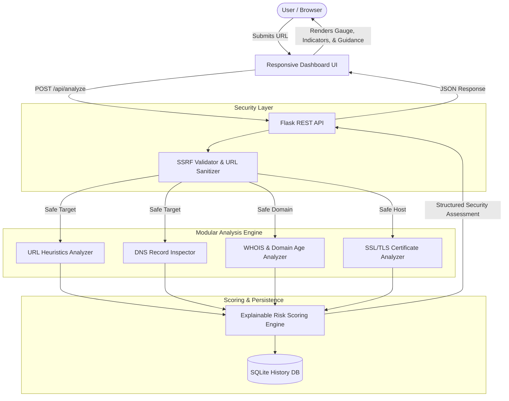

# PhishGuard — Phishing Website Detection System

An enterprise-grade, explainable, and secure educational cybersecurity web application for analyzing website URLs, inspecting infrastructure metadata (DNS, WHOIS, SSL/TLS certificates), and computing transparent phishing risk scores.


---

## 1. Project Overview

PhishGuard provides security analysts, students, and everyday users with immediate, explainable intelligence regarding suspicious or fraudulent links. Rather than acting as an opaque "black-box" classifier, PhishGuard computes an itemized **0–100 Risk Score** showing exactly which indicators contributed to the security rating and why.

> [!NOTE]
> **Educational & Research Purpose Only:** Automated heuristic analysis provides probabilistic threat assessment. It is not an absolute guarantee of safety or maliciousness.

---

## 2. Key Features

- **Lexical & URL Heuristics Analysis:**
  - Length metrics (total URL, domain, path, query strings).
  - High-risk TLD detection (`.xyz`, `.top`, `.tk`, `.buzz`, `.click`, `.rest`, etc.).
  - Brand impersonation & spoofing detection against 25+ major targets (PayPal, Apple, Google, Microsoft, Netflix, Amazon, Chase, etc.).
  - Homograph and Punycode (`xn--`) attack detection.
  - Subdomain depth, excessive dot/hyphen counts, and Shannon Entropy (random/DGA detection).
  - Obfuscation techniques (e.g. `@` symbols, double slashes `//`, hex/percent encoding).
  - Dangerous payload / executable extension detection (`.exe`, `.scr`, `.apk`, `.bat`, `.iso`, `.zip`).

- **Domain & WHOIS Intelligence:**
  - Domain creation date, expiration date, and updated date.
  - Calculated domain age in days/years (flagging domains < 30 days old as high risk).
  - WHOIS privacy proxy detection (e.g. Domains By Proxy, WhoisGuard, Cloudflare Privacy).
  - Domain expiration urgency warnings.

- **SSL / TLS Certificate Inspection:**
  - Certificate validity, subject common name (CN), and alternative names (SANs).
  - Issuer hierarchy (DigiCert, Let's Encrypt, Cloudflare, Sectigo, etc.).
  - Hostname matching and self-signed certificate detection.
  - **Educational Emphasis:** Explains why **HTTPS does NOT equal legitimate** (over 60% of modern phishing pages utilize free SSL certificates).

- **DNS & Network Resolution:**
  - Safe inspection of IPv4 (A), IPv6 (AAAA), Mail Exchangers (MX), and Nameservers (NS).
  - Detection of non-existent domains (NXDOMAIN) or missing mail infrastructure.
  - Direct raw IP host detection.

- **Enterprise SSRF Protection:**
  - Strict pre-flight validation preventing server-side requests to `localhost`, `127.0.0.1`, RFC 1918 private subnets (`10.0.0.0/8`, `172.16.0.0/12`, `192.168.0.0/16`), link-local addresses, and cloud metadata endpoints (`169.254.169.254`, `metadata.google.internal`).

- **Interactive Cybersecurity Dashboard:**
  - Dark-mode interface with animated SVG Risk Gauge and score counter.
  - Color-coded risk status badges (`Likely Safe`, `Suspicious`, `High Risk`, `Very High Risk`).
  - Actionable security guidance tailored to specific detected threats.
  - Local SQLite scan history drawer with one-click report reloading.
  - Copy full assessment to clipboard or export as structured JSON.

---

## 3. Technology Stack

- **Backend:** Python 3.9+, Flask, Werkzeug
- **Security & Network:** `python-whois`, `dnspython`, `tldextract`, `cryptography`, `requests`
- **Database:** SQLite 3 (lightweight, zero-config local history storage)
- **Frontend:** HTML5, CSS3 (Modern cyber theme, glassmorphism, responsive grid), Vanilla JavaScript (ES6+)
- **Testing:** `pytest`

---

## 4. System Architecture



---

## 5. Risk Scoring Framework

The scoring engine calculates a transparent **0 to 100 risk score** based on rule-based heuristic weights:

| Score Range | Risk Level | Indicator Color | Interpretation |
| :--- | :--- | :--- | :--- |
| **0 – 25** | **Likely Safe** | Emerald Green (`#10b981`) | Standard structural patterns; no overt phishing indicators. |
| **26 – 50** | **Suspicious** | Amber Yellow (`#f59e0b`) | Moderate anomalies (e.g. unencrypted HTTP, young domain, suspicious keywords). |
| **51 – 75** | **High Risk** | Orange / Coral (`#f97316`) | Multiple strong phishing signals (e.g. brand keywords on mismatched domain, high-abuse TLD). |
| **76 – 100** | **Very High Risk** | Crimson Red (`#ef4444`) | Critical threats (e.g. direct IP hosting, brand spoofing with download payload). |

### Heuristic Weights Example
- **Direct IP Address Host:** `+35 Risk`
- **Brand Impersonation / Spoofing:** `+30 Risk`
- **Punycode / Homograph Attack:** `+25 Risk`
- **Newly Registered Domain (< 30 days):** `+25 Risk`
- **Malware Payload / Executable in Path:** `+25 Risk`
- **Unencrypted HTTP Protocol:** `+15 Risk`
- **Suspicious / High-Abuse TLD (`.xyz`, `.top`):** `+12 Risk`
- **Excessive Subdomains (>= 3):** `+12 Risk`
- **Established Domain Age (> 3 years):** `-10 Risk (Trust Factor)`
- **Valid CA-Signed SSL Certificate:** `-5 Risk (Trust Factor)`

---

## 6. Installation & Setup

### Prerequisites
- Python 3.9 or higher
- Git (optional)

### 1. Clone or Open Project Directory
```bash
cd "Phishing Website Detection System"
```

### 2. Create and Activate Virtual Environment
```bash
python3 -m venv venv
source venv/bin/activate  # On Windows: venv\Scripts\activate
```

### 3. Install Dependencies
```bash
pip install -r requirements.txt
```

### 4. Configuration (Optional)
Copy `.env.example` to `.env` if you wish to customize port or host settings:
```bash
cp .env.example .env
```

---

## 7. Running the Application

Start the Flask application server:
```bash
python3 app.py
```

Open your web browser and navigate to:
```
http://127.0.0.1:5001
```

---

## 8. API Documentation

### `POST /api/analyze`
Submits a URL for comprehensive security analysis.

**Request Body (`application/json`):**
```json
{
  "url": "https://secure-paypal-login.update-account.xyz/verify"
}
```

**Response Example (`200 OK`):**
```json
{
  "status": "success",
  "submitted_url": "https://secure-paypal-login.update-account.xyz/verify",
  "sanitized_url": "https://secure-paypal-login.update-account.xyz/verify",
  "hostname": "secure-paypal-login.update-account.xyz",
  "domain": "update-account.xyz",
  "risk_score": 67,
  "risk_level": "High Risk",
  "risk_tier": "high",
  "badge_color": "#f97316",
  "summary": "This URL demonstrates multiple strong indicators characteristic of active phishing or spoofing campaigns.",
  "indicator_count": 3,
  "indicators": [
    {
      "category": "Brand & Deception",
      "id": "brand_impersonation",
      "name": "Brand Spoofing Detected (Paypal)",
      "points": 30,
      "severity": "critical",
      "explanation": "The URL mentions the targeted brand 'Paypal', but the registered domain is not an official domain for that brand.",
      "evidence": "Brand: Paypal | Registered Domain: update-account.xyz"
    },
    {
      "category": "URL Structure",
      "id": "suspicious_tld",
      "name": "High-Abuse Top-Level Domain (.xyz)",
      "points": 12,
      "severity": "medium",
      "explanation": "The top-level domain '.xyz' has a statistically high rate of abuse and malicious registrations.",
      "evidence": ".xyz"
    }
  ],
  "positive_factors": [],
  "recommendations": [
    "⛔ DO NOT enter any passwords, account credentials, credit card details, or sensitive personal information on this page.",
    "🛡️ This link appears to spoof Paypal. Navigate to the official domain directly."
  ],
  "url_analysis": { ... },
  "domain_analysis": { ... },
  "ssl_analysis": { ... },
  "dns_analysis": { ... },
  "disclaimer": "Educational and authorized cybersecurity research only."
}
```

### `GET /api/history`
Returns a list of recent scan records stored in SQLite.

### `GET /api/history/<id>`
Retrieves full stored JSON analysis for a specific scan ID.

### `DELETE /api/history`
Clears all saved scan records.

### `GET /api/health`
Returns service status and timestamp.

---

## 9. Running Tests

Run the complete test suite with `pytest`:
```bash
./venv/bin/pytest -v
```

Tests cover:
- SSRF prevention & private IP / cloud metadata blocking
- URL lexical heuristics & brand spoofing detection
- Punycode / homograph parsing
- Risk scoring bounds and tier classifications
- Flask API endpoints and SQLite history operations

---

## 10. Security Considerations

1. **SSRF Mitigation:** All URLs undergo pre-flight hostname and IP resolution checks before any remote socket connection is established. Private subnets (RFC 1918), loopback, link-local, and cloud metadata IPs (`169.254.169.254`) are strictly blocked.
2. **Safe Handshakes:** All network probes (WHOIS, DNS, SSL) utilize strict timeouts (2.5–3.5s) and catch exceptions to guarantee the server never crashes or hangs.
3. **No Code Execution:** The system performs passive metadata inspection only; it never renders remote JavaScript or downloads/executes payloads.

---

## 11. Limitations & Future Enhancements

- **Limitations:** Heuristic analysis evaluates static features. Highly sophisticated attackers using clean newly-aged domains or zero-day redirects might score lower if no active reputation data exists.
- **Future Improvements:**
  - Machine Learning classifier (Random Forest / XGBoost model trained on PhishTank and Tranco Top 1M).
  - Integration with live threat intelligence feeds (Google Safe Browsing API, VirusTotal, AbuseIPDB).
  - Visual similarity screenshot comparison.
  - Browser extension for real-time navigation alerts.
